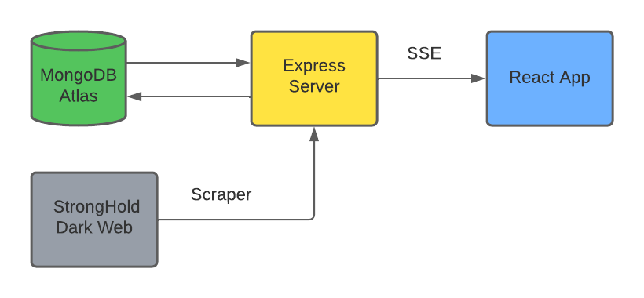

# Dark Web Scraping Project

## Assignment

In this project I was asked to develop a scraping, analysis and presentation platform to one of the most hideous places on the dark-web:  <b>The Stronghold Paste Site</b>.  This site contains a lot of criminal activity, ranging from illegal hacking and data theft attempts, through hitmans and other criminal services for sell and all the way to links to child pornography sites.

- The platfrom will scrape data from the pastes posted in the stronghold website and auto scrape every 2 minutes
- It will be able to display all pastes collected alongside analysis of the data

## Architecture Design

## Features

- Analytics Page - shows data based analytics divided by catagories and hourly traffic.
- Feed Page- shows all pastes scraped to the DB - allows user to read all the pastes content and search by title/author/content

## Technologies and libraries used:

- JavaScript
- React.js
- Express.js
- MongoDB Atlas
- Mongoose ODM
- Docker
- Axios
- Bootstrap
- Chart.js
- Loadash - Debounce
- HtmlParser

## Screenshots

